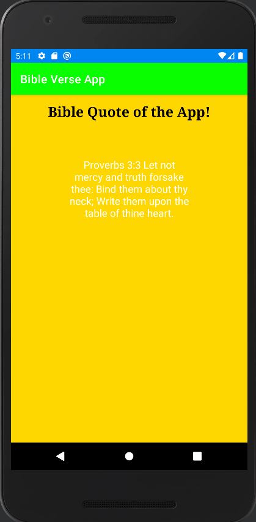

## Bible Verse App

Displays a random Bible verse out of twelve at startup. Uses Java's Random class to generate a random number from 1 to 12 inclusive. Read the documentation on it [here](https://docs.oracle.com/javase/7/docs/api/java/util/Random.html).

### The UI

